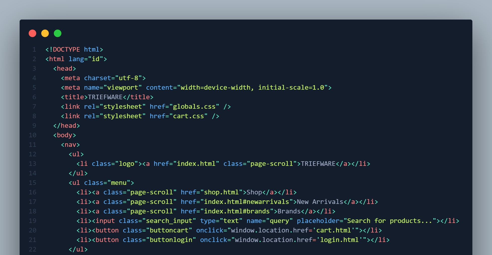

Laporan Tugas Pemrograman Web SRS 

             Disusun oleh:

                 1.Muhammad Avie Siena (22091397103)
                 2.Muhammad Faaizul Hakim  (22091397075)
                 3.Mochamad Satria Cahya Nugraha (22091397110)

        Program Studi D4 Menejemen Informatika 
       Fakultas Vokasi Universitas Negeri Surabaya 
                         2023

        1. Tujuan
        
 Tujuan identifikasi mengenai produk website Thrifting adalah untuk menjelaskan cakupan 
dari produk yang dijelaskan dalam dokumen SRS, termasuk tujuan dari website, fungsi utama, karakteristik 
pengguna, lingkungan operasional, kendala desain dan implementasi, dokumentasi pengguna, asumsi dan 
ketergantungan. Dengan tujuan ini, pembaca dokumen akan memahami produk yang akan dikembangkan dan
 batasan serta kondisi yang harus dipertimbangkan dalam mengembangkan website tersebut.

        3. Lampiran

           a. Flowchart
              

           b.UseCase 

       4. Penjelasan Code

          a. HTML

<!DOCTYPE html>: Mendeklarasikan dokumen sebagai HTML5. Ini memberi tahu browser jenis dokumen yang dihadapi dan bagaimana menafsirkannya.

<html lang="id">: Tag pembuka untuk dokumen HTML. Atribut lang="id" menunjukkan bahwa konten di halaman ini dalam bahasa Indonesia.
  
<head>: Bagian kepala dari halaman web. Berisi meta-informasi tentang dokumen dan tautan ke stylesheet, skrip, dan sumber daya lainnya.
  
<meta name="viewport" content="width=device-width, initial-scale=1.0">: Menyediakan instruksi untuk browser tentang bagaimana mengontrol dimensi halaman dan penskalaan. Ini penting untuk responsivitas situs web di perangkat mobile.

cmeta charset="utf-8">: Sepertinya ada kesalahan pengetikan di sini. Seharusnya <meta charset="utf-8">, yang mendeklarasikan pengkodean karakter halaman sebagai UTF-8, standar untuk pengkodean multibahasa.

<title>#TEFNARF</title>: Judul halaman yang akan muncul di tab browser.

<link rel="stylesheet" href-"globals.css" />: Ada kesalahan sintaks. Atribut href harus menggunakan = bukan -. Ini adalah tautan ke file stylesheet eksternal yang bernama "globals.css".

<link rel="stylesheet" href="cart.css" />: Tautan ke file stylesheet lain yang bernama "cart.css".

</head>: Penutup tag kepala.

<body>: Tag pembuka untuk isi utama dari halaman web.
  
<nav>: Tag pembuka untuk navigasi halaman.
  
di class="logo"><a href="index.ht index.html" class="page-scroll">TRIE MARE</a></LI>: Ada beberapa kesalahan di sini. Sepertinya seharusnya <li class="logo"> dengan tautan ke "index.html". Ini adalah item daftar yang berfungsi sebagai logo dan tautan ke halaman utama.
  
cl class-"menu">: Sepertinya seharusnya <ul class="menu">. Ini mengindikasikan awal dari daftar yang berfungsi sebagai menu navigasi.
  
Dari baris 14-20, Anda memiliki item daftar (<li>) yang berisi tautan atau input.
  
<11> dan </li>: Ada kesalahan sintaks dan tag yang tidak dikenali. Sepertinya ini seharusnya <li>.
  
<li><button class="buttoncart" onclick="window.location.href='cart.html"></li>: Item daftar yang berisi tombol untuk mengarahkan pengguna ke halaman "cart.html".
  
<li><button class="buttonlogin" onclick="window.location.href="login.html""></li>: Item daftar yang berisi tombol untuk mengarahkan pengguna ke halaman "login.html", tetapi ada kesalahan dalam atribut onclick.
  
</ul>: Penutup tag untuk daftar menu.

          b.CSS

 
