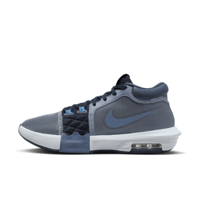
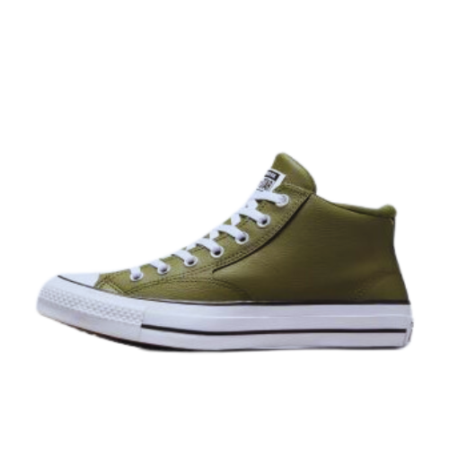
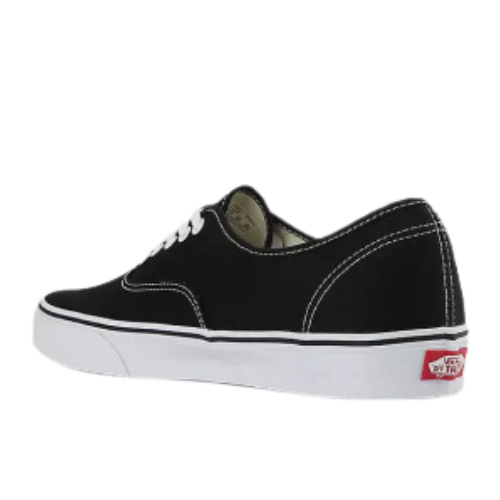
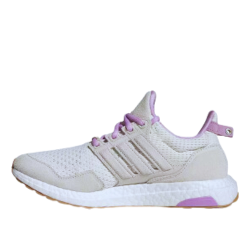
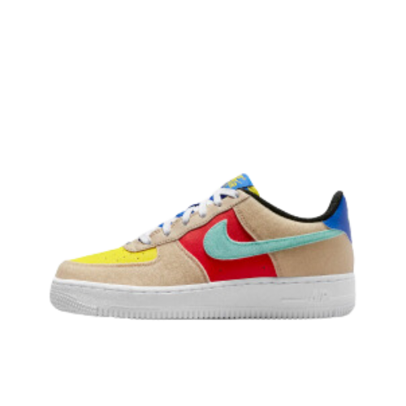

Laporan Tugas Pemrograman Web SRS 

             Disusun oleh:

                 1.Muhammad Avie Siena (22091397103)
                 2.Muhammad Faaizul Hakim  (22091397075)
                 3.Mochamad Satria Cahya Nugraha (22091397110)

        Program Studi D4 Menejemen Informatika 
       Fakultas Vokasi Universitas Negeri Surabaya 
                         2023

BAB 1 PENDAHULUAN 

	  1.1 Tujuan
        
  Dokumen ini bertujuan menjelaskan bagaimana perancangan sebuah web site yg berfokus pada penjualan sepatu thrifting / sepatu bekas impor original dan tentunya berkualitas. Web site ini akan menampilkan laman home, shop, dan cara pesan. Dokumen ini akan menjadi panduan bagi tim pengembangan dalam merancang dan mengimplementasikan situs web.

        1.2 Audien yang Dituju dan  Pembaca yang Disarankan
	
Web thrifting ditujukan untuk berbagai kelompok individu, termasuk penggemar thrifting, pelajar, penggemar mode berkelanjutan, pengoleksi, serta pengusaha dan penjual. Kesadaran mengenai keberlanjutan dan keuntungan ekonomi membuat thrifting menjadi menarik bagi berbagai demografi. Selain itu, website tersebut juga direkomendasikan untuk pembaca yang baru mengenal konsep thrifting, desainer, seniman, aktivis lingkungan, pemasar, analis bisnis, serta pembuat kebijakan. Memahami kedua kategori ini memungkinkan pemilik web thrifting untuk menyajikan konten dan fitur yang relevan, memaksimalkan keterlibatan pengguna, dan meningkatkan kesuksesan platform mereka.

        1.3	Batasan Produk 
	
Produk ini hanya mencakup pembelian produk thrifting sepatu dengan cara mengorder melalui website dengan berbagai macam merek sepatu dan berbagai macam ukuran serta harga yg bervariasi. Produk ini tidak mencakup untuk pembelian non sepatu seperti sendal, tas, ataupun barang-barang yg lainnya 

	 1.4	Definisi dan Istilah
 
Berikut adalah definisi dan penjelasan singkat untuk istilah-istilah yang mungkin memerlukan klarifikasi:
-	SRS (Software Requirements Specification): Dokumen ini sendiri, yang merupakan Spesifikasi Kebutuhan Perangkat Lunak. SRS menguraikan secara terperinci persyaratan perangkat lunak yang akan dikembangkan.
-	IEEE (Institute of Electrical and Electronics Engineering): Sebuah organisasi internasional yang mengembangkan standar untuk berbagai bidang teknik, termasuk standar terkait pengembangan perangkat lunak. IEEE sering kali diacu dalam konteks standar industri dan praktik terbaik.

        1.5	Referensi
 	
https://www.thrifted.com/?gclid=CjwKCAjw1t2pBhAFEiwA_-A-NMe6X-VGarXz-CDqmQa55pGf0cNlegnbJJ16tQ0pPnUaAe8-5bfFOhoC5RgQAvD_BwE

BAB 2 DESKRIPSI KESELURUHAN

	2.1 Deskripsi Produk
 
Website Triefware adalah sebuah platform yang dirancang untuk pembelian sepatu thrifting, website ini menyediakan berbagai macam pilihan sepatu branded serta berbagai macam merek, ukuran dan pilihan harga yang sangat bervariatif. Website ini juga menyediakan berbagai macan model sepatu seperti sepatu formal, sneakers, sport dll dengan berbagai macam model mengikuti perkembangan jaman style dan fashion sekarang.

	2.2 Penggolongan Karakterik Pengguna
 
Dalam pengembangan platform website " Triefware " berbagai kategori pengguna telah diidentifikasi, masing-masing dengan tugas, hak akses ke Web Site, dan kemampuan yang  harus dimiliki. Berikut adalah penjelasan lebih rinci tentang karakteristik pengguna:

Tabel 1 Karakteristik Pengguna

	2.3	Lingkungan Operasi
 

	2.4	Batas Desain dan Implementasi
 
Batasan Desain dan Implementasi merujuk pada keterbatasan atau kendala yang perlu diperhatikan selama proses pembuatan dan pelaksanaan sebuah website, khususnya website thrifting. Hal ini penting untuk memastikan bahwa proyek dapat diselesaikan dengan efektif dan efisien sambil memenuhi kebutuhan utama pengguna. Berikut adalah penjelasan dari batasan Desain dan Implementasi pada website thrifting:

1.Keterbatasan Teknologi:

        ●Desain: Website mungkin perlu didesain dengan mempertimbangkan teknologi yang saat ini tersedia, termasuk perangkat keras, perangkat lunak, dan platform hosting.
	
        ●Implementasi: Website mungkin perlu diintegrasikan dengan sistem pembayaran, pengiriman, atau teknologi lain, yang masing-masing memiliki keterbatasannya sendiri.
	
2.Responsif dan Kompatibilitas:

        ●Desain: Situs harus responsif, artinya harus dapat ditampilkan dengan baik di berbagai jenis perangkat, dari desktop hingga mobile.
	
        ●Implementasi: Penerapan desain responsif mungkin memerlukan penggunaan kerangka kerja atau alat tertentu yang mempengaruhi kecepatan dan kinerja situs.
	
3.Keamanan:

        ●Desain: Mengingat sifat transaksional website thrifting, keamanan menjadi prioritas, seperti proteksi terhadap serangan DDoS, SQL injection, dan lainnya.
	
        ●Implementasi: Penerapan fitur keamanan, seperti enkripsi, firewall, dan autentikasi dua faktor, dapat mempengaruhi kompleksitas dan waktu pengembangan.
	
4.Integrasi dengan Pihak Ketiga:

        ●Desain: Situs mungkin perlu mengintegrasikan API dari penyedia pembayaran, layanan pengiriman, atau platform media sosial.
	
        ●Implementasi: Keterbatasan dari API pihak ketiga, seperti batasan pemanggilan atau fitur yang ditawarkan, dapat mempengaruhi fungsi dan kinerja situs.
	
5.Keterbatasan Anggaran dan Sumber Daya:

        ●Desain: Anggaran yang terbatas mungkin mempengaruhi keputusan desain, seperti pemilihan grafik, animasi, atau fitur khusus.
	
        ●Implementasi: Keterbatasan anggaran dan sumber daya manusia dapat mempengaruhi kecepatan pengembangan dan cakupan fitur yang diimplementasikan.
	
6.User Experience (UX):

        ●Desain: UX harus menjadi prioritas, dengan pertimbangan pada navigasi intuitif, estetika, dan kecepatan loading.
	
        ●Implementasi: Komponen yang mempengaruhi UX, seperti waktu loading halaman atau animasi, perlu dioptimalkan dan diuji.
	
7.Scalability:

        ●Desain: Dengan pertumbuhan potensial dari platform thrifting, desain harus mempertimbangkan skalabilitas di masa depan.
	
        ●Implementasi: Pilihan teknologi, struktur basis data, dan arsitektur backend harus mendukung pertumbuhan pengguna dan data.

Dengan memahami batasan Desain dan Implementasi ini, tim pengembangan dapat memastikan bahwa website thrifting tidak hanya fungsional dan memenuhi kebutuhan pengguna tetapi juga dapat diadaptasi dan ditingkatkan di masa mendatang.

3.	Kebutuhan Antarmuka Eksternal
   
	3.1	 User Interfaces
Ruang lingkup Website "Thrifting" meliputi bagian-bagian yang terdapat dalam Website "Thrifting" yang telah dibuat. Berikut deskripsi singkat mengenai ruang lingkup Website Pribadi ini:

	3.1.1 Bagian Index HTML

	3.1.2 Bagian SHOP

	3.1.3 Bagian CART.HTML
 

	3.1.4 Bagian LOGIN.HTML

     BAB 4 Functional Requirement
     
Bagian ini akan menggambarkan kebutuhan fungsional untuk produk " Triefware " yang mencakup fitur-fitur sistem dan layanan utama yang akan disediakan oleh produk ini. Kebutuhan ini akan diorganisir dalam bentuk tabel dengan ID dan penjelasan yang  diperlukan.

           a. Flowchart
              

           b.UseCase 

5.  Non Functional Requirements

Kebutuhan non-fungsional untuk platform "Thrifting" akan diuraikan dalam tabel berikut:

6. Penjelasan Code
	
A. index.html
	<!DOCTYPE html>
<html lang="id">
  <head>
	<meta charset="UTF-8">
    <meta name="viewport" content="width=device-width, initial-scale=1.0">
    <title>TRIEFWARE</title>
    <link rel="stylesheet" href="globals.css" />
    <link rel="stylesheet" href="style.css" />
  </head>
  <body>
    <nav>
		<ul>
		  <li class="logo"><a href="index.html" class="page-scroll">TRIEFWARE</a></li>
		</ul>
		<ul class="menu">
		  <li><a class="page-scroll" href="shop.html">Shop</a></li>
		  <li><a class="page-scroll" href="#newarrivals">New Arrivals</a></li>
		  <li><a class="page-scroll" href="#brands">Brands</a></li>
		  <li><input class="search_input" type="text" name="query" placeholder="Search for products..."></li>
		  <li><button class="buttoncart" onclick="window.location.href='cart.html'"></li>
		  <li><button class="buttonlogin" onclick="window.location.href='login.html'"></li>
		</ul>
	  </nav>
	<header id="home" >
			

				

					<h1>FIND SHOES THAT   <b>MATCHES YOUR STYLE</b></h1>
				

				

					<button onclick="window.location.href='shop.html'">Shop Now</button>
				

				
			

			

				

					<h1>200+</h1>
					
International Brands

				

				

					<h1>+2.000</h1>
					
High-Quality Products

				

				

					<h1>+30.000</h1>
					
Happy Customers

				
	
			

	</header>
    <section id="newarrivals">
		

			<h1>New Arrivals</h1>
			

				

					

						
						
Nike Pegasus 40

						
Rp. 2,399,000

					

					

						
						
Adidas NMD_S1 Shoes

						
Rp. 2,099,000

					

					

						
						
Reebok Eenergen LITE Men

						
Rp. 2.900.000

					

					

						
						
Air Jordan 1 Elevate High

						
Rp. 559.000

					

				

				

					

						
						
Adidas X_PLRBOOST Shoes

						
Rp. 2.250.000

					

					

						
						
Chuck Taylor Remastered

						
Rp. 1.599.000

					

					

						
						
Nike Air Max 90

						
Rp. 2,099,000

					

					

						
						
New Balance 990

						
Rp. 4.799.000

					

				

				

					<button href="#">View All</button>
				

				

					
<h1>BROWSE BY STYLE</h1>

					<button class="buttoncasual" href="#">Casual</button>
					<button class="buttonformal" href="#">Formal</button>
					<button class="buttonsport" href="#">Sport</button>
				

			

		

    </section>
	<section id="brands">
		

			<h1>Brands</h1>
			

				

					

						
					

					

						
					

					

						
					

					

						
					

					

						
					

				

			

		

	</section>
	<section class="contact">
		

			<h1 class="contact_text">STAY UP TO DATE ABOUT OUR LATEST OFFERS</h1>
		

		

			<input class="search_contact" type="text" name="query" placeholder="Enter your email Address">
		

		

			<button href="#">Subcribe to Newsletter</button>
		

	</section>
	 
	 
	<section>
		

	</section>
	<section class="footer">

        

            

                <h3>get help</h3>
                <a href="">FAQ</a>
                <a href="">Shipping</a>
                <a href="">Returns</a>
                <a href="">Payment Status</a>
                <a href="">Privacy Policy</a>
            

            

                <h3>quick links</h3>
                <a href="index.html">home</a>
                <a href="shop.html">products</a>
                <a href="#newarrivals">new arrivals</a>
                <a href="#brands">brands</a>
            

            

                <h3>contact info</h3>
                <a href="#">+62 895-0452-7071</a>
                <a href="#">+62 813-3084-6262</a>
                <a href="#" class="lower">triefware@gmail.com</a>
                <a href="#" class="lower">customercare@gmail.com</a>
                <a href="#">Surabaya, Indonesia - 60230</a>
            

            

                <h3>follow us</h3>
                
                
                
                
                
            

        

    </section>
    <footer>
        
&copy; 2023 TRIEFWARE. All rights reserved.

    </footer>
</body>
</html>

1.	<!DOCTYPE html>: Mendefinisikan jenis dokumen HTML yang digunakan, dalam hal ini, dokumen HTML5.
2.	<html lang="id">: Mengawali elemen HTML dan menentukan bahasa untuk halaman web (dalam hal ini, bahasa Indonesia).
3.	<head>: Ini adalah bagian kepala dokumen HTML yang berisi elemen-elemen metadata dan tautan ke sumber daya 		eksternal. Beberapa elemen penting dalam bagian ini termasuk pengaturan karakter, viewport, judul halaman, dan 		tautan ke file CSS.
4.	<meta charset="UTF-8">: Mengatur pengaturan karakter untuk halaman menggunakan UTF-8.
5.	<meta name="viewport" content="width=device-width, initial-scale=1.0">: Menentukan pengaturan tampilan yang sesuai 	untuk perangkat dengan lebar layar (viewport) yang berbeda.
6.	<title>TRIEFWARE</title>: Mendefinisikan judul halaman web yang akan ditampilkan pada tab peramban.
7.	<link rel="stylesheet" href="globals.css" /> dan `<link rel="stylesheet" href="style.css" />: Ini adalah tautan ke 	file CSS eksternal yang digunakan untuk mengatur tampilan halaman.
8.	<body>: Ini adalah elemen yang berisi konten utama halaman web. Semua elemen yang terlihat pada halaman akan berada 	di dalam elemen ini.
9.	<nav>: Ini adalah bagian navigasi atas. Ini berisi elemen-elemen seperti logo, menu navigasi, kotak pencarian, 		tombol keranjang, dan tombol login.
10.	<header id="home">: Ini adalah elemen header yang berisi teks judul, tombol "Shop Now," dan informasi tentang 		jumlah merek internasional, produk berkualitas tinggi, dan jumlah pelanggan bahagia.
11.	<section id="newarrivals">: Ini adalah bagian yang berisi produk-produk terbaru, termasuk gambar produk, nama 		produk, dan harga.
12.	<section id="brands">: Ini adalah bagian yang berisi merek-merek yang ditampilkan dengan logo-logo mereka.
13.	<section class="contact">: Ini adalah bagian yang berisi formulir masuk atau kotak teks untuk berlangganan 		newsletter.
14.	<section class="footer">: Ini adalah bagian footer atau kaki halaman yang berisi tautan ke halaman lain, informasi 	kontak, tautan media sosial, dan hak cipta.

B. style.css

/* Use reset to make all elements consistent */
html, body, div, span, applet, object, iframe,
h1, h2, h3, h4, h5, h6, p, blockquote, pre, a,
abbr, acronym, address, big, cite, code, del,
dfn, em, img, ins, kbd, q, s, samp, small,
strike, strong, sub, sup, tt, var, b, u, i,
center, dl, dt, dd, ol, ul, li, fieldset,
form, label, legend, table, caption, tbody,
tfoot, thead, tr, th, td, article, aside,
canvas, details, embed, figure, figcaption,
footer, header, hgroup, menu, nav, output,
ruby, section, summary, time, mark, audio,
video {
  margin: 0;
  padding: 0;
  border: 0;
  font-size: 100%;
  font: inherit;
  vertical-align: baseline;
}

/* HTML5 display-role reset for older browsers */
article, aside, details, figcaption,
figure, footer, header, hgroup,
menu, nav, section {
  display: block;
}

body {
  line-height: 1;
}

ol, ul {
  list-style: none;
}

table {
  border-collapse: collapse;
  border-spacing: 0;
}

/* Additional resets to make elements render consistently in all browsers */
button,
input,
select,
textarea {
  font-size: 100%;
  margin: 0;
}

button,
input {
  line-height: normal;
}

button,
select {
  text-transform: none;
}

/* NAVBAR */
nav{
	height: 85px;
	display: flex;
	padding: 40px 80px;
	position: fixed;
	background: white;
	background-size: cover;
	border-bottom: 2px solid;
	top: -10px;
	left: 0;
	right: 0;
	font-family: "Abhaya Libre ExtraBold-Regular", Helvetica;
	z-index: 999;
	transition: .3s;
	
}
nav ul li {
	display: inline-block;
}
ul.menu li{
    margin-top: -10px;
	margin-left: 25px;
	font-size: 20px; 
}
nav ul li a{
	text-decoration: none;
	color: black;
	transition: .2s;
}
.logo a{
	font-size: 40px;
	line-height: 20px;
}
nav a:hover{
	color: #454D7A;
}
.logo{	
	margin-top: 0px;
	margin-right: 80px;
}
.search_input{
  margin-left: 0px;
  margin-right: 0px;
  border-radius: 15px;
  width: 550px;
  padding: 0px 20px;
  height: 30px;
  background-color: transparent;
  transition: transform 250ms ease-in-out;
  font-size: 14px;
  line-height: 18px;
  color: #575756;
  background-color: transparent;
  background-image: url(./img/kacapembesar.png);
  background-repeat: no-repeat;
  background-size: 18px 18px;
  background-position: 97% center;
  border-radius: 50px;
  border: 1px solid #575756;
  transition: all 250ms ease-in-out;
  backface-visibility: hidden;
  transform-style: preserve-3d;
}
.search_input input{
  border: 1px solid #ccc;
  border-radius: 3px;
}
.buttoncart {
    color: white;
    width: 30px;
    height: 30px;
    border-radius: 50%;
    background: url(./img/cart.png);
    background-repeat: no-repeat;
    background-position:center;
    display: flex;
    align-items: center;
    transition: 0.4s;
	cursor: pointer;
}
.buttonlogin {
    color: white;
    width: 30px;
    height: 30px;
    border-radius: 50%;
    background: url(./img/login.png);
    background-repeat: no-repeat;
    background-position:center;
    display: flex;
    align-items: center;
    transition: 0.4s;
	cursor: pointer;
}

/* HEADER */
header {
	height: 100vh;
	background: url(./img/Background-toko.png);
	background-size: cover;
	position: relative;

}
.judul {
	position: absolute;
	top: 50%;
	left: 23%;
	transform: translate(-50%,-65%);
	width: 100%;
	height: 250px;
	text-align: left;
	box-sizing: border-box;
	padding: 0px 200px;
	display: flex;
	align-items: center;
	flex-direction: column;
  font-family: "Antonio-Bold", Helvetica;
}
.judul h1 {
	font-size: 46px;
	line-height: 50px;
	color: black;
	font-weight: bold;
  	margin-bottom: 30px;	

}
.judul h1 b{
	font-weight: bold;
	font-size: 46px;
  	color: black;
}
.buttonshopnow{
	margin-left: -330px;
}
.buttonshopnow button{
	border: none;
	width: 200px;
	height: 45px;
	background: black;
	color: white;
	font-size: 15px;
	border-radius: 20px;
	cursor: pointer;
	font-weight: lighter;
	transition: .2s;
}
.buttonshopnow button:hover{
	background-color: gray;
}
.fitur {
	position: absolute;
  	top: 49%;
  	left: -27%;
	width: 100%;
	height: 200px;
	padding: 0px 500px;
	display: flex;
  	font-family: "Antonio-Bold", Helvetica;
	align-items: center;
	color: black;
  	justify-content: space-between;
}
.kotak h1{
  font-size: 40px;
  font-weight: 700;
}
.kotak p{
	font-size: 16px;
	color: black;
  font-weight: 400;
}

/* Section NewArrival */
.arrival{
    display: flex;
    flex-direction: column;
    text-align: center;
}
.arrival h1{
	font-size: 40px;
	margin-top: 90px;
	font-family: "Antonio-Bold", Helvetica;
	font-weight: 700;
}
.produk1{
    display: flex;
    justify-content: space-evenly;
    margin-top: 30px;
    text-decoration: none;
}
.produk2{
    display: flex;
    justify-content: space-evenly;
    margin-top: 40px;
    text-decoration: none;
}
.box img{
    border-radius: 10px;
    background: #AFB0AD;
	border-color: #B3A492;
    border-style: solid;
	margin-bottom: 10px;
}
.box p{
    text-decoration: none;
    color:black;
	margin-top: 15px;
	font-weight: 700;
	font-size: 21px;
	font-family: "Abhaya Libre-Bold", Helvetica;
	text-align: center;
}
.viewall1 button{
	margin-top: 40px;
	border: 2px solid;
	border-color: black;
	width: 200px;
	height: 45px;
	background: white;
	color: black;
	font-size: 15px;
	border-radius: 20px;
	cursor: pointer;
	font-weight: lighter;
	transition: .2s;
}
.viewall1 button:hover{
	background-color: gray;
}
.persegi{
	position: relative;
	margin-top: 70px;
	margin-left: 135px;
	width: 1239px;
	height: 850px;
	background-color: #efefef;
	border-radius: 40px;
	overflow: hidden;
}
.persegi .judul-persegi{
	margin-top: 60px;
}
.buttoncasual {
	margin-top: 50px;
    color: black;
	font-family: "Abhaya Libre ExtraBold-Regular", Helvetica;
	margin-left: 70px;
    width: 407px;
    height: 289px;
	font-weight: 700;
	font-size: 36px;
    border-radius: 10px;
    background: url(./img/Casual.png);
    display: flex;
    align-items: center;
    transition: 0.4s;
	cursor: pointer;
}
.buttonformal {
	margin-top: -287px;
    color: black;
	font-family: "Abhaya Libre ExtraBold-Regular", Helvetica;
	margin-left: 500px;
    width: 670px;
    height: 289px;
	font-weight: 700;
	font-size: 36px;
    border-radius: 10px;
    background: url(./img/formal.png);
    display: flex;
    align-items: center;
    transition: 0.4s;
	cursor: pointer;
}
.buttonsport {
	margin-top: 20px;
    color: black;
	font-family: "Abhaya Libre ExtraBold-Regular", Helvetica;
	margin-left: 70px;
    width: 1101px;
    height: 289px;
	font-weight: 700;
	font-size: 36px;
    border-radius: 10px;
    background: url(./img/sport.png);
    display: flex;
    align-items: center;
    transition: 0.4s;
	cursor: pointer;
}

/* Section brands*/
.brand{
    display: flex;
    flex-direction: column;
    margin-top: 40px;
    text-align: center;
}
.tulisanbrand h1{
	font-size: 48px;
	margin-top: 50px;
	margin-left: 40px;
	font-family: "Antonio-Bold", Helvetica;
	font-weight: 700;
}
.branding{
    display: flex;
    flex-direction: column;
    text-align: center;
	width: 1440px;
	margin-left: 40px;
	height: 250px;
	border-radius: 20px;
	border: 1px solid gray;
}
.branding-1{
    display: flex;
    justify-content: space-evenly;
    margin-top: 20px;
    text-decoration: none;
}
.box_brand img{
    border-radius: 10px;
	border-color: transparent;
    border-style: solid;
	margin-bottom: 10px;
}

/*section contact*/
.contact{
	display: flex;
    margin-top: 60px;
	width: 1245px;
	margin-left: 130px;
	height: 168px;
	background-color: #000000;
	border-radius: 20px;
	
}
.contact_text{
	font-family: "Abhaya Libre ExtraBold-Regular", Helvetica;
	font-weight: 700;
	color: #ffffff;
	justify-content: space-evenly;
	width: 665px;
	height: 70px;
	font-size: 40px;
	margin-top: 40px;
	margin-left: 40px;
}
.search_contact{
	margin-top: 40px;
	margin-left: 200px;
	width: 300px;
	padding: 0px 20px;
	height: 40px;
	border-radius: 25px;
	position: absolute;
	background-color: white;
	transition: transform 250ms ease-in-out;
	font-size: 14px;
	line-height: 18px;
	color: #575756;
	background-image: url(./img/Mail.png);
	background-repeat: no-repeat;
	background-size: 18px 18px;
	background-position: 95% center;
	border: 1px solid #575756;
	transition: all 250ms ease-in-out;
	backface-visibility: hidden;
	transform-style: preserve-3d;
}
.button_contact button{
	margin-top: 85px;
	margin-left: 203px;
	border: 2px solid;
	position: absolute;
	width: 300px;
	height: 40px;
	border-radius: 25px;
	border-color: black;
	background: white;
	color: black;
	font-size: 15px;
	cursor: pointer;
	font-weight: lighter;
	transition: .2s;
}
.button_contact button:hover{
	background-color: red;
}

/*garis section bawah*/
.garis-footer {
	background-color: grey;
	color: grey;
	height: 1px;
	margin-left: 40px;
	margin-right: 40px;
}

/* footer Section */
.footer .footer-container{
    display: grid;
    grid-template-columns: repeat(auto-fit, minmax(20rem, 1fr));
    gap: 3.2rem;
    margin-top: 40px;
    margin-bottom: 20px;
	margin-left: 50px;
}
#contact a{
    text-decoration: none;
}
#follow{
    margin-left: 30px;
}
.lower{
    text-transform: lowercase;
}
.footer .footer-container .box h3{
    padding: .5rem 0;
    font-size: 2rem;
    color: #192a56;
}
.footer .footer-container .box a{
    display: block;
    padding: .5rem 0;
    font-size: 16px;
    color: #666;
}
.footer .footer-container .box a:hover{
    color: blue;
    text-decoration: underline;
}

/* SOCIAL MEDIA */
.social-media{
    display: flext;
    text-align: center;
    margin-left: 100px;
    float: right;
}
.social-media h3{
    font-size: 2rem;
    color: #192a56;
}
.social-media img{
    width: 30px;
    margin-top: 10px;
    margin-left: 2px;
}
.social-media img:hover{
    border: solid 2px #0D1282;
    border-radius: 50%;
    color: #0D1282;
}

/* Style footer */
footer {
  background-color: #333;
  color: #fff;
  text-align: center;
  margin-top: 50px;
  padding: 10px 0;
}

1.	Reset Styles: Bagian ini adalah reset CSS yang mengatur beberapa elemen HTML agar memiliki tampilan yang lebih 		konsisten di berbagai peramban web. Ini termasuk mengatur margin, padding, border, dan beberapa properti font 		untuk banyak elemen HTML.
2.	HTML5 Display-Role Reset: Bagian ini mengatur elemen-elemen HTML dengan display role sesuai agar sesuai dengan 		HTML5, dan menjadi display: block pada peramban web lama yang mungkin tidak mendukungnya.
3.	Body Styles: Ini adalah aturan yang mengatur tampilan elemen <body>, termasuk pengaturan line-height menjadi 1.
4.	List Styles: Bagian ini menghilangkan tanda bullet pada elemen <ul> (unordered list) dan <ol> (ordered list).
5.	Table Styles: Ini mengatur tampilan elemen <table> agar memiliki border-collapse: collapse dan border-spacing: 0, 	yang membuat tabel tampak lebih konsisten di seluruh peramban.
6.	Additional Resets: Bagian ini mengatur ulang tampilan beberapa elemen seperti button, input, select, dan textarea. 	Ini mencakup mengatur font-size menjadi 100% dan menghilangkan margin.
7.	Navbar Styles: Ini adalah aturan untuk tampilan elemen-elemen dalam bagian navbar. Ini mencakup pengaturan tinggi 	(height), tampilan flex, warna latar belakang, ukuran teks, dan efek perubahan warna saat tautan dihover.
8.	Search Input Styles: Ini mengatur tampilan elemen pencarian (search input) termasuk ukuran, warna, latar belakang, 	dan penggunaan gambar latar belakang untuk ikon kaca pembesar.
9.	Header Styles: Bagian ini mengatur tampilan elemen-elemen dalam header, termasuk pengaturan gambar latar belakang, 	ukuran teks, dan tombol "Shop Now."
10.	Section New Arrival Styles: Ini mengatur tampilan elemen-elemen dalam bagian "New Arrival," termasuk judul, 		produk, dan tombol "View All."
11.	Section Categories Styles: Bagian ini mengatur tampilan elemen-elemen dalam bagian kategori produk, termasuk 		tombol untuk kategori Casual, Formal, dan Sport.
12.	Section Brands Styles: Ini mengatur tampilan elemen-elemen dalam bagian "Brands," termasuk judul dan merek-merek 	produk yang ditampilkan.
13.	Section Contact Styles: Ini mengatur tampilan elemen-elemen dalam bagian kontak, termasuk judul, kotak pencarian, 	dan tombol "Contact Us."
14.	Footer Styles: Ini adalah aturan yang mengatur tampilan elemen-elemen dalam footer, termasuk warna latar belakang, 	tautan ke halaman lain, dan ikon media sosial.

C. shop.html

<!DOCTYPE html>
<html lang="id">
  <head>
    <meta charset="UTF-8">
    <meta name="viewport" content="width=device-width, initial-scale=1.0">
    <title>TRIEFWARE</title>
    <link rel="stylesheet" href="globals.css" />
    <link rel="stylesheet" href="shop.css" />
  </head>
  <body>
    <nav>
      <ul>
        <li class="logo"><a href="index.html" class="page-scroll">TRIEFWARE</a></li>
      </ul>
      <ul class="menu">
        <li><a class="page-scroll" href="shop.html">Shop</a></li>
        <li><a class="page-scroll" href="index.html#newarrivals">New Arrivals</a></li>
        <li><a class="page-scroll" href="index.html#brands">Brands</a></li>
        <li><input class="search_input" type="text" name="query" placeholder="Search for products..."></li>
        <li><button class="buttoncart" onclick="window.location.href='cart.html'"></li>
        <li><button class="buttonlogin" onclick="window.location.href='login.html'"></li>
      </ul>
    </nav>
    <section id="shop" class="shop_atas">
		  <h1>SHOP</h1>
		  

			  

          

            <h1>Filters</h1>
            
          

          

          

            <h1>Casual</h1>
            
          

          

            <h1>formal</h1>
            
          

          

            <h1>Sport</h1>
            
          

          

          

            <h1>Colors</h1>
            
          

          

            

              
              
              
              
              
            

            

              
              
              
              
              
            

          

          

          

            <h1>Size</h1>
            
          

          

            

              

                <button href="#">US 7</button>
              

              

                <button href="#">US 7.5</button>
              

            

            

              

                <button href="#">US 8</button>
              

              

                <button href="#">US 8.5</button>
              

            

            

              

                <button href="#">US 9</button>
              

              

                <button href="#">US 9.5</button>
              

            

            

              

                <button href="#">US 10</button>
              

              

                <button href="#">US 10.5</button>
              

            

          

          

          

            <button href="#">Apply Filter</button>
          

			  

        

          

            

              
              
Sanada Longwing Black

              
Rp. 265,000

            

            

              
              
Call It Spring

              
Rp. 1.190.000

            

            

              
              
Lebron Witness 8 EP

              
Rp. 1,549,000

            

            

              
              
Sanada Longwing Grain Black Genuine Leather

              
Rp. 450,000

            

          

          

            

              
              
Malden Street

              
Rp. 2.000.000

            

            

              
              
Sanada Derby Black

              
Rp. 600,000

            

            

              
              
Vans Uy Authentic

              
Rp. 549.000

            

            

              
              
Nanoflex Adventure TR Training Shoes

              
Rp. 1.039.200

            

          

          

            

              
              
Jordan Stadium 90

              
Rp. 2.199.000

            

            

              
              
Ultraboost 1.0 Shoes

              
Rp. 3.300.000

            

            

              
              
Fluxlite Training Shoes

              
Rp. 699.000

            

            

              
              
Air Force 1 LV8

              
Rp. 1,449,000

            

          

        

		  

    </section>
	  <section class="contact">
		  

			  <h1 class="contact_text">STAY UP TO DATE ABOUT OUR LATEST OFFERS</h1>
		  

		  

			  <input class="search_contact" type="text" name="query" placeholder="Enter your email Address">
		  

		  

			  <button href="#">Subcribe to Newsletter</button>
		  

	  </section>
     
	   
	  <section>
		  

	  </section>
	  <section class="footer">

          

              

                  <h3>get help</h3>
                  <a href="">FAQ</a>
                  <a href="">Shipping</a>
                  <a href="">Returns</a>
                  <a href="">Payment Status</a>
                  <a href="">Privacy Policy</a>
              

              

                  <h3>quick links</h3>
                  <a href="index.html">home</a>
                  <a href="shop.html">products</a>
                  <a href="index.html#newarrivals">new arrivals</a>
                  <a href="index.html#brands">brands</a>
              

              

                  <h3>contact info</h3>
                  <a href="#">+62 895-0452-7071</a>
                  <a href="#">+62 813-3084-6262</a>
                  <a href="#" class="lower">triefware@gmail.com</a>
                  <a href="#" class="lower">customercare@gmail.com</a>
                  <a href="#">Surabaya, Indonesia - 60230</a>
              

              

                  <h3>follow us</h3>
                  
                  
                  
                  
                  
              

          

      </section>
      <footer>
          
&copy; 2023 TRIEFWARE. All rights reserved.

      </footer>
</body>
</html>

1.	<!DOCTYPE html>: Ini adalah deklarasi tipe dokumen yang mendefinisikan bahwa dokumen ini adalah dokumen HTML5.
2.	<html lang="id">: Ini adalah tag root atau awal dari dokumen HTML. lang="id" mengindikasikan bahwa bahasa yang 		digunakan adalah Bahasa Indonesia.
3.	<head>: Ini adalah bagian kepala dari dokumen HTML yang biasanya berisi informasi tentang dokumen, termasuk 		metadata, tautan ke berkas CSS, judul halaman, dan lainnya.
•	<meta charset="UTF-8">: Mengatur pengkodean karakter ke UTF-8, yang mendukung karakter internasional.
•	<meta name="viewport" content="width=device-width, initial-scale=1.0">: Mendefinisikan tampilan responsif untuk 	perangkat seluler dengan mengatur lebar viewport sesuai dengan lebar perangkat dan skalanya ke 1.
•	<title>TRIEFWARE</title>: Menentukan judul halaman yang akan ditampilkan di tab peramban.
•	<link rel="stylesheet" href="globals.css" />: Mengimpor berkas CSS globals.css yang digunakan untuk gaya global 	halaman.
•	<link rel="stylesheet" href="shop.css" />: Mengimpor berkas CSS shop.css yang digunakan untuk gaya halaman toko.
4.	<body>: Ini adalah elemen yang berisi konten utama halaman web.
•	<nav>: Ini adalah elemen navigasi yang berisi menu navigasi untuk halaman web. Terdapat logo TRIEFWARE dan 		beberapa tautan menu.
•	<ul>: Ini adalah elemen daftar tak berurutan yang berisi elemen-elemen daftar menu.
•	<li class="logo">: Ini adalah elemen daftar yang berisi logo TRIEFWARE dan tautan kembali ke halaman utama.
•	<ul class="menu">: Ini adalah elemen daftar tak berurutan kedua yang berisi menu-menu navigasi lainnya, seperti 	"Shop," "New Arrivals," "Brands," kotak pencarian, tombol keranjang (cart), dan tombol masuk (login).
•	<section id="shop" class="shop_atas">: Ini adalah elemen berdasarkan ID "shop" yang mendefinisikan bagian toko 		(shop) di halaman. Ini termasuk judul "SHOP" dan filter produk.
•	<h1>SHOP</h1>: Ini adalah elemen judul yang menampilkan teks "SHOP."
•	
: Ini adalah elemen yang berisi filter produk.
•	Berbagai elemen lainnya, seperti label filter, gambar panah, kotak warna, dan ukuran yang digunakan untuk mengatur 	dan menerapkan filter pada produk.
•	
: Ini adalah elemen yang berisi daftar produk yang ditampilkan dalam beberapa grup 		(produk1, produk2, produk3). Setiap grup terdiri dari kotak-kotak produk dengan gambar produk, nama produk, dan 	harga.
•	<section class="contact">: Ini adalah elemen yang mendefinisikan bagian kontak di halaman, termasuk kotak input 	email dan tombol "Subscribe to Newsletter."
•	
: Ini adalah elemen yang digunakan untuk menampilkan garis pemisah antara konten dan 		footer.
•	<section class="footer">: Ini adalah elemen yang mendefinisikan bagian footer dari halaman. Ini berisi beberapa div 	dengan tautan ke FAQ, beranda, produk, dan informasi kontak, serta ikon media sosial.
•	<footer>: Ini adalah elemen footer yang menampilkan hak cipta dan tahun hak cipta.

D. shop.css

/* Use reset to make all elements consistent */
html, body, div, span, applet, object, iframe,
h1, h2, h3, h4, h5, h6, p, blockquote, pre, a,
abbr, acronym, address, big, cite, code, del,
dfn, em, img, ins, kbd, q, s, samp, small,
strike, strong, sub, sup, tt, var, b, u, i,
center, dl, dt, dd, ol, ul, li, fieldset,
form, label, legend, table, caption, tbody,
tfoot, thead, tr, th, td, article, aside,
canvas, details, embed, figure, figcaption,
footer, header, hgroup, menu, nav, output,
ruby, section, summary, time, mark, audio,
video {
  margin: 0;
  padding: 0;
  border: 0;
  font-size: 100%;
  font: inherit;
  vertical-align: baseline;
}

/* HTML5 display-role reset for older browsers */
article, aside, details, figcaption,
figure, footer, header, hgroup,
menu, nav, section {
  display: block;
}

body {
  line-height: 1;
}

ol, ul {
  list-style: none;
}

table {
  border-collapse: collapse;
  border-spacing: 0;
}

/* Additional resets to make elements render consistently in all browsers */
button,
input,
select,
textarea {
  font-size: 100%;
  margin: 0;
}

button,
input {
  line-height: normal;
}

button,
select {
  text-transform: none;
}

/* NAVBAR */
nav{
	height: 85px;
	display: flex;
	padding: 40px 80px;
	position: fixed;
	background: white;
	background-size: cover;
	border-bottom: 2px solid;
	top: -10px;
	left: 0;
	right: 0;
	font-family: "Abhaya Libre ExtraBold-Regular", Helvetica;
	z-index: 999;
	transition: .3s;
	
}
nav ul li {
	display: inline-block;
}
ul.menu li{
    margin-top: -10px;
	margin-left: 25px;
	font-size: 20px; 
}
nav ul li a{
	text-decoration: none;
	color: black;
	transition: .2s;
}
.logo a{
	font-size: 40px;
	line-height: 20px;
}
nav a:hover{
	color: #454D7A;
}
.logo{	
	margin-top: 0px;
	margin-right: 80px;
}
.search_input{
  margin-left: 0px;
  margin-right: 0px;
  border-radius: 15px;
  width: 550px;
  padding: 0px 20px;
  height: 30px;
  background-color: transparent;
  transition: transform 250ms ease-in-out;
  font-size: 14px;
  line-height: 18px;
  color: #575756;
  background-color: transparent;
  background-image: url(./img/kacapembesar.png);
  background-repeat: no-repeat;
  background-size: 18px 18px;
  background-position: 97% center;
  border-radius: 50px;
  border: 1px solid #575756;
  transition: all 250ms ease-in-out;
  backface-visibility: hidden;
  transform-style: preserve-3d;
}
.search_input input{
  border: 1px solid #ccc;
  border-radius: 3px;
}
.buttoncart {
    color: white;
    width: 30px;
    height: 30px;
    border-radius: 50%;
    background: url(./img/cart.png);
    background-repeat: no-repeat;
    background-position:center;
    display: flex;
    align-items: center;
    transition: 0.4s;
	cursor: pointer;
}
.buttonlogin {
    color: white;
    width: 30px;
    height: 30px;
    border-radius: 50%;
    background: url(./img/login.png);
    background-repeat: no-repeat;
    background-position:center;
    display: flex;
    align-items: center;
    transition: 0.4s;
	cursor: pointer;
}

/*Section Shop*/
.shop_atas h1{
	font-size: 40px;
	font-family: "Abhaya Libre ExtraBold-Regular", Helvetica;
	font-weight: 700;
	text-align: left;
	margin-top: 100px;
    margin-left: 85px;
}

.filter_image {
	display: flex;
	margin-top: 25px;
	
}

/* Section Filter */
.frame_filter{
    margin-top: 0px;
	margin-left: 85px;
	margin-right: 100px;
	width: 295px;
	height: 900px;
	border-radius: 20px;
	border: 1px solid gray;
}
.flexfilters{
	display: flex;

}
.frame_filter h1{
	font-family: Abhaya Libre;
	margin-top: 20px;
	font-size: 20px;
	font-style: normal;
	margin-left: 20px;
	font-weight: 700;
	line-height: normal;
	color: #000000;
	margin-right: 50px;
}
.frame_filter img{
	margin-top: 20px;
	margin-left: 120px;
}
.garisatas1 {
	background-color: grey;
	color: grey;
	height: 1px;
	margin: 25px 20px;
}
.flexfilters1 {
	display: flex;
	margin-top: 0px;
}
.flexfilters2 {
	display: flex;
}
.flexfilters2 img {
	margin-left: 120px;
}
.flexfilters3 {
	display: flex;
}
.flexfilters3 img {
	margin-left: 130px;
}
.garisatas2 {
	background-color: grey;
	color: grey;
	height: 1px;
	margin: 25px 20px;
}
.flexcolor1 {
	display: flex;
}
.flexframecolor{
	text-decoration: none;
	margin-left: 20px;
}
.flexcolor2 {
	display: flex;
}
.flexcolor2 img{
	margin-left: 0px;
	margin-right: 20px; 
}
.flexcolor3 {
	display: flex;
}
.flexcolor3 img{
	margin-left: 0px;
	margin-right: 20px;
}
.garisatas3 {
	background-color: grey;
	color: grey;
	height: 1px;
	margin: 25px 20px;
}
.flexsize1{
	display: flex;
}
.flexsize1 img{
	margin-left: 140px;
}
.flexframesize {
	text-decoration: none;
	margin-left: 20px;
	margin-top: 20px;
}
.buttonsize button{
	font-size: 15px;
	border-radius: 20px;
	width: 96px;
	height: 37px;
	color: grey;
	background-color: #F0F0F0;
	font-family: "Abhaya Libre ExtraBold-Regular", Helvetica;
	cursor: pointer;
	transition: .2s;
	font-weight: lighter;
}
.buttonsize button:hover{
	background-color: black;
}
.flexsize2 {
	margin-top: 0px;
	display: flex;
}
.flexsize3 {
	margin-top: 10px;
	display: flex;
}
.flexsize4 {
	margin-top: 10px;
	display: flex;
}
.flexsize5 {
	margin-top: 10px;
	display: flex;
}
.flexsize6 {
	margin-top: 10px;
}
.garisatas4 {
	background-color: grey;
	color: grey;
	height: 1px;
	margin: 25px 20px;
}
.buttonfilterapply{
	margin-left: 20px;
}
.buttonfilterapply button{
	font-size: 15px;
	border-radius: 20px;
	width: 247px;
	height: 48px;
	color: white;
	background-color: black;
	font-family: "Abhaya Libre ExtraBold-Regular", Helvetica;
	cursor: pointer;
	transition: .2s;
	font-weight: lighter;
}
.buttonfilterapply button:hover{
	background-color: grey;
}

/*Section Produk*/
.produk_produk{
	display: flex;
}
.produk1{
    text-decoration: none;
	padding-right: 40px;
}
.produk2{
	text-decoration: none;
	padding-right: 30px;
}
.produk3{
	text-decoration: none;
}
.box{
	padding-bottom: 100px;
}
.box img{
    border-radius: 10px;
    background: #AFB0AD;
	border-color: #B3A492;
    border-style: solid;
	margin-bottom: 10px;
}
.box p{
    text-decoration: none;
    color:black;
	margin-top: 15px;
	font-weight: 700;
	font-size: 21px;
	font-family: "Abhaya Libre-Bold", Helvetica;
	text-align: left;
}

/*section contact*/
.contact{
	display: flex;
    margin-top: 60px;
	width: 1245px;
	margin-left: 130px;
	height: 168px;
	background-color: #000000;
	border-radius: 20px;
	
}
.contact_text{
	font-family: "Abhaya Libre ExtraBold-Regular", Helvetica;
	font-weight: 700;
	color: #ffffff;
	justify-content: space-evenly;
	width: 665px;
	height: 70px;
	font-size: 40px;
	margin-top: 40px;
	margin-left: 40px;
}
.search_contact{
	margin-top: 40px;
	margin-left: 200px;
	width: 300px;
	padding: 0px 20px;
	height: 40px;
	border-radius: 25px;
	position: absolute;
	background-color: white;
	transition: transform 250ms ease-in-out;
	font-size: 14px;
	line-height: 18px;
	color: #575756;
	background-image: url(./img/Mail.png);
	background-repeat: no-repeat;
	background-size: 18px 18px;
	background-position: 95% center;
	border: 1px solid #575756;
	transition: all 250ms ease-in-out;
	backface-visibility: hidden;
	transform-style: preserve-3d;
}
.button_contact button{
	margin-top: 85px;
	margin-left: 203px;
	border: 2px solid;
	position: absolute;
	width: 300px;
	height: 40px;
	border-radius: 25px;
	border-color: black;
	background: white;
	color: black;
	font-size: 15px;
	cursor: pointer;
	font-weight: lighter;
	transition: .2s;
}
.button_contact button:hover{
	background-color: red;
}

/*garis section bawah*/
.garis-footer {
	background-color: grey;
	color: grey;
	height: 1px;
	margin-left: 40px;
	margin-right: 40px;
}

/* footer Section */
.footer .footer-container{
    display: grid;
    grid-template-columns: repeat(auto-fit, minmax(20rem, 1fr));
    gap: 3.2rem;
    margin-top: 40px;
    margin-bottom: -30px;
	margin-left: 50px;
}
#contact a{
    text-decoration: none;
}
#follow{
    margin-left: 30px;
}
.lower{
    text-transform: lowercase;
}
.footer .footer-container .box h3{
    padding: .5rem 0;
    font-size: 2rem;
    color: #192a56;
}
.footer .footer-container .box a{
    display: block;
    padding: .5rem 0;
    font-size: 16px;
    color: #666;
}
.footer .footer-container .box a:hover{
    color: blue;
    text-decoration: underline;
}

/* SOCIAL MEDIA */
.social-media{
    display: flext;
    text-align: center;
    margin-left: 100px;
    float: right;
}
.social-media h3{
    font-size: 2rem;
    color: #192a56;
}
.social-media img{
    width: 30px;
    margin-top: 10px;
    margin-left: 2px;
}
.social-media img:hover{
    border: solid 2px #0D1282;
    border-radius: 50%;
    color: #0D1282;
}

/* Style footer */
footer {
  background-color: #333;
  color: #fff;
  text-align: center;
  margin-top: 0px;
  padding: 10px 0;
}

1.	Reset Styling: Bagian ini adalah aturan yang mereset beberapa properti CSS standar untuk berbagai elemen HTML. 		Tujuan dari ini adalah untuk memastikan bahwa semua elemen HTML memiliki tampilan yang konsisten di berbagai 		peramban. Misalnya, menghapus margin dan padding bawaan, mengatur font size ke 100%, dan menghilangkan dekorasi 	teks seperti garis bawah di tautan.
2.	HTML5 Display-role Reset: Ini adalah aturan yang menetapkan elemen HTML5 seperti <article>, <aside>, <header>, 		dan lainnya untuk memiliki peran "display: block" sehingga mereka akan dirender sebagai elemen blok.
3.	Body Styling: Ini mengatur beberapa properti untuk elemen <body>, seperti mengatur line-height menjadi 1 dan 		memberi elemen tersebut tampilan yang lebih konsisten.
4.	List Styling: Ini mengatur elemen <ol> (ordered list) dan <ul> (unordered list) untuk tidak menampilkan 		poin/bullet list secara default.
5.	Table Styling: Ini mengatur tampilan tabel dengan menghilangkan jarak antar sel dan mengatur penggabungan batas 	tabel.
6.	Additional Resets: Aturan ini mengatur elemen-elemen seperti tombol, input, select, dan textarea agar tampilan 		mereka lebih konsisten di berbagai peramban. Misalnya, menghilangkan border, mengatur font size ke 100%, dan 		mereset beberapa properti lainnya.
7.	Navbar Styling: Ini adalah aturan yang mengatur tampilan navbar (menu navigasi) pada halaman web. Ini termasuk 		mengatur tinggi, latar belakang, jenis huruf, dan tampilan logo, tautan, serta perubahan warna saat tautan dihover.
8.	Section Shop Styling: Ini mengatur tampilan elemen-elemen pada bagian "Shop" halaman, termasuk judul, filter, dan 	gambar produk.
9.	Filter Styling: Ini mengatur tampilan elemen filter seperti label, gambar panah, warna, dan ukuran. Ini juga 		mengatur tampilan tombol "Apply Filter."
10.	Produk Styling: Ini mengatur tampilan elemen-elemen yang menampilkan daftar produk, seperti gambar produk, nama 	produk, dan harga.
11.	Section Contact Styling: Ini mengatur tampilan elemen pada bagian "Contact," termasuk teks, kotak input, dan 		tombol "Subscribe to Newsletter."
12.	Garis Footer Styling: Ini mengatur tampilan garis pemisah antara konten dan footer.
13.	Footer Styling: Ini mengatur tampilan elemen-elemen footer, termasuk daftar tautan dan ikon media sosial, serta 	tampilan footer dengan latar belakang warna dan teks berwarna putih.

E. cart.html

<!DOCTYPE html>
<html lang="id">
  <head>
    <meta charset="UTF-8">
    <meta name="viewport" content="width=device-width, initial-scale=1.0">
    <title>TRIEFWARE</title>
    <link rel="stylesheet" href="globals.css" />
    <link rel="stylesheet" href="cart.css" />
  </head>
  <body>
    <nav>
      <ul>
        <li class="logo"><a href="index.html" class="page-scroll">TRIEFWARE</a></li>
      </ul>
      <ul class="menu">
        <li><a class="page-scroll" href="shop.html">Shop</a></li>
        <li><a class="page-scroll" href="index.html#newarrivals">New Arrivals</a></li>
        <li><a class="page-scroll" href="index.html#brands">Brands</a></li>
        <li><input class="search_input" type="text" name="query" placeholder="Search for products..."></li>
		<li><button class="buttoncart" onclick="window.location.href='cart.html'"></li>
		<li><button class="buttonlogin" onclick="window.location.href='login.html'"></li>
      </ul>
    </nav>
    <section id="cart" class="yourcart">
        <h1>Your cart</h1>
        

            

                

                    <h1>ORDER NOW</h1>
                

            

            

                

                    <h1>Order Summary:</h1>
                    <h2>Subtotal:</h2>
                    <h3>Discount:</h3>
                    <h4>Delivery Fee:</h4>
                    <h5>Total:</h5>
                

                

                    

                        <input class="search_promo" type="text" name="query" placeholder="Add promo code">
                    

                    

                        

                            <button href="#">Apply</button>
                        

                    

                

                

                    <button href="#">Go to Checkout</button>
                

            

        

    </section>
    <section class="contact">
		

			<h1 class="contact_text">STAY UP TO DATE ABOUT OUR LATEST OFFERS</h1>
		

		

			<input class="search_contact" type="text" name="query" placeholder="Enter your email Address">
		

		

			<button href="#">Subcribe to Newsletter</button>
		

	</section>
     
	 
	<section>
		

	</section>
	<section class="footer">

        

            

                <h3>get help</h3>
                <a href="">FAQ</a>
                <a href="">Shipping</a>
                <a href="">Returns</a>
                <a href="">Payment Status</a>
                <a href="">Privacy Policy</a>
            

            

                <h3>quick links</h3>
                <a href="index.html">home</a>
                <a href="shop.html">products</a>
                <a href="index.html#newarrivals">new arrivals</a>
                <a href="index.html#brands">brands</a>
            

            

                <h3>contact info</h3>
                <a href="#">+62 895-0452-7071</a>
                <a href="#">+62 813-3084-6262</a>
                <a href="#" class="lower">triefware@gmail.com</a>
                <a href="#" class="lower">customercare@gmail.com</a>
                <a href="#">Surabaya, Indonesia - 60230</a>
            

            

                <h3>follow us</h3>
                
                
                
                
                
            

        

    </section>
    <footer>
        
&copy; 2023 TRIEFWARE. All rights reserved.

    </footer>
</body>
</html>

1.	Deklarasi Dokumen: Ini adalah deklarasi dokumen HTML5 yang memberitahu peramban bahwa dokumen tersebut adalah 		dokumen HTML versi 5.
2.	Element <html>: Ini adalah elemen root yang memulai struktur dokumen HTML. Atribut lang disetel ke "id" untuk 		menunjukkan bahwa bahasa yang digunakan dalam dokumen adalah bahasa Indonesia.
3.	Element <head>: Ini adalah bagian kepala dokumen yang mengandung meta-informasi dan tautan ke file eksternal. 		Berikut adalah beberapa elemen di dalamnya:
•	<meta charset="UTF-8">: Ini mengatur karakter set dokumen ke UTF-8, yang umumnya digunakan untuk mendukung 		karakter internasional.
•	<meta name="viewport" content="width=device-width, initial-scale=1.0">: Ini mengatur tampilan responsif halaman 	web pada perangkat bergerak.
•	<title>TRIEFWARE</title>: Ini mengatur judul halaman web yang akan ditampilkan pada tab peramban.
•	<link rel="stylesheet" href="globals.css" />: Ini adalah tautan ke file CSS "globals.css" yang akan digunakan 		untuk mengatur tampilan halaman.
•	<link rel="stylesheet" href="cart.css" />: Ini adalah tautan ke file CSS "cart.css" yang akan digunakan untuk 		mengatur tampilan halaman.
4.	Element <body>: Ini adalah elemen yang mengandung konten aktual halaman web. Di dalamnya, terdapat elemen-elemen 	seperti:
•	<nav>: Ini adalah elemen yang mengandung menu navigasi (navbar) yang berisi tautan ke halaman-halaman lainnya. 		Tautan ini mengarahkan pengguna ke berbagai bagian dari situs web.
•	<section id="cart" class="yourcart">: Ini adalah bagian konten halaman web dengan id "cart" yang berisi informasi 	tentang keranjang belanja.
•	<section class="contact">: Ini adalah bagian konten halaman web yang berisi informasi untuk berlangganan 		newsletter.
•	<section>: Ini adalah elemen umum yang digunakan untuk membuat beberapa bagian tambahan di halaman web.
•	<footer>: Ini adalah elemen yang berisi informasi hak cipta dan biasanya mengandung tautan sosial media.
5.	Tautan ke Gambar: Beberapa tautan ke gambar sosial media seperti Facebook, Instagram, Twitter, YouTube, dan 		LinkedIn juga dimasukkan ke dalam halaman web di bagian footer.

F. cart.css

/* Use reset to make all elements consistent */
html, body, div, span, applet, object, iframe,
h1, h2, h3, h4, h5, h6, p, blockquote, pre, a,
abbr, acronym, address, big, cite, code, del,
dfn, em, img, ins, kbd, q, s, samp, small,
strike, strong, sub, sup, tt, var, b, u, i,
center, dl, dt, dd, ol, ul, li, fieldset,
form, label, legend, table, caption, tbody,
tfoot, thead, tr, th, td, article, aside,
canvas, details, embed, figure, figcaption,
footer, header, hgroup, menu, nav, output,
ruby, section, summary, time, mark, audio,
video {
  margin: 0;
  padding: 0;
  border: 0;
  font-size: 100%;
  font: inherit;
  vertical-align: baseline;
}

/* HTML5 display-role reset for older browsers */
article, aside, details, figcaption,
figure, footer, header, hgroup,
menu, nav, section {
  display: block;
}

body {
  line-height: 1;
}

ol, ul {
  list-style: none;
}

table {
  border-collapse: collapse;
  border-spacing: 0;
}

/* Additional resets to make elements render consistently in all browsers */
button,
input,
select,
textarea {
  font-size: 100%;
  margin: 0;
}

button,
input {
  line-height: normal;
}

button,
select {
  text-transform: none;
}

/* NAVBAR */
nav{
	height: 85px;
	display: flex;
	padding: 40px 80px;
	position: fixed;
	background: white;
	background-size: cover;
	border-bottom: 2px solid;
	top: -10px;
	left: 0;
	right: 0;
	font-family: "Abhaya Libre ExtraBold-Regular", Helvetica;
	z-index: 999;
	transition: .3s;
	
}
nav ul li {
	display: inline-block;
}
ul.menu li{
    margin-top: -10px;
	margin-left: 25px;
	font-size: 20px; 
}
nav ul li a{
	text-decoration: none;
	color: black;
	transition: .2s;
}
.logo a{
	font-size: 40px;
	line-height: 20px;
}
nav a:hover{
	color: #454D7A;
}
.logo{	
	margin-top: 0px;
	margin-right: 80px;
}
.search_input{
  margin-left: 0px;
  margin-right: 0px;
  border-radius: 15px;
  width: 550px;
  padding: 0px 20px;
  height: 30px;
  background-color: transparent;
  transition: transform 250ms ease-in-out;
  font-size: 14px;
  line-height: 18px;
  color: #575756;
  background-color: transparent;
  background-image: url(./img/kacapembesar.png);
  background-repeat: no-repeat;
  background-size: 18px 18px;
  background-position: 97% center;
  border-radius: 50px;
  border: 1px solid #575756;
  transition: all 250ms ease-in-out;
  backface-visibility: hidden;
  transform-style: preserve-3d;
}
.search_input input{
  border: 1px solid #ccc;
  border-radius: 3px;
}
.buttoncart {
    color: white;
    width: 30px;
    height: 30px;
    border-radius: 50%;
    background: url(./img/cart.png);
    background-repeat: no-repeat;
    background-position:center;
    display: flex;
    align-items: center;
    transition: 0.4s;
	cursor: pointer;
}
.buttonlogin {
    color: white;
    width: 30px;
    height: 30px;
    border-radius: 50%;
    background: url(./img/login.png);
    background-repeat: no-repeat;
    background-position:center;
    display: flex;
    align-items: center;
    transition: 0.4s;
	cursor: pointer;
}

/* Section yourcart */
.yourcart {
    display: flex;
    flex-direction: column;
    margin-top: 30px;
}
.yourcart h1{
    margin-top: 100px;
    margin-left: 85px;
    margin-bottom: 25px;
    top: 0;
    left: 0;
    font-family: "Abhaya Libre ExtraBold-Regular", Helvetica;
    font-weight: 700;
    font-size: 40px;
    letter-spacing: 0;
    line-height: normal;
}
.cart_samping{
    display: flex;
    margin-right: 85px;
    text-decoration: none;
}
.frame_cart{
    flex-direction: column;
    margin-top: 0px;
	margin-left: 85px;
	color: gray;
	width: 715px;
	height: 508px;
	border-radius: 20px;
	border: 1px solid;
}
.frame_cart h1{
	font-family: Abhaya Libre;
	margin-top: 215px;
    margin-left: 10px;
    text-align: center;
	font-size: 70px;
	font-style: normal;
	font-weight: 700;
	line-height: normal;
}

/* Order */
.frame_order{
	color: gray;
	width: 505px;
    margin-left: 80px;
	height: 458px;
    padding: 10px 10px;
	border-radius: 20px;
	border: 1px solid;
}
.frame_order h1{
	font-family: Abhaya Libre;
    font-size: 24px;
    margin-top: 20px;
	font-style: normal;
    text-align: left;
    margin-left: 10px;
	font-weight: 700;
	line-height: normal;
}
.frame_order h2{
	font-family: Abhaya Libre;
    font-size: 24px;
    margin-top: 20px;
	font-style: normal;
    text-align: left;
    margin-left: 10px;
	font-weight: 700;
	line-height: normal;
}
.frame_order h3{
	font-family: Abhaya Libre;
    font-size: 24px;
    margin-top: 20px;
	font-style: normal;
    text-align: left;
    margin-left: 10px;
	font-weight: 700;
	line-height: normal;
}
.frame_order h4{
	font-family: Abhaya Libre;
    font-size: 24px;
    margin-top: 20px;
	font-style: normal;
    text-align: left;
    margin-left: 10px;
	font-weight: 700;
	line-height: normal;
}
.frame_order h5{
	font-family: Abhaya Libre;
    font-size: 24px;
    margin-top: 60px;
	font-style: normal;
    text-align: left;
    margin-left: 10px;
	font-weight: 700;
	line-height: normal;
}
.inputbutton{
    display: flex;
    text-decoration: none;
}
.search_promo{
    margin-left: 10px;
    margin-top: 20px;
    border-radius: 15px;
    width: 320px;
    padding: 0px 20px;
    height: 45px;
    background-color: transparent;
    transition: transform 250ms ease-in-out;
    font-size: 14px;
    line-height: 18px;
    color: #575756;
    background-color: transparent;
    background-image: url(./img/promo.png);
    background-repeat: no-repeat;
    background-size: 18px 18px;
    background-position: 97% center;
    border-radius: 50px;
    border: 1px solid #575756;
    transition: all 250ms ease-in-out;
    backface-visibility: hidden;
    transform-style: preserve-3d;
}
.search_input input{
    border: 1px solid #ccc;
    border-radius: 3px;
}
.button_apply button{
	margin-top: 20px;
    margin-left: 10px;
	border: 2px solid;
	border-color: black;
	width: 120px;
	height: 45px;
	background: black;
	color: white;
	font-size: 15px;
	border-radius: 20px;
	cursor: pointer;
	font-weight: lighter;
	transition: .2s;
}
.button_apply button:hover{
	background-color: gray;
}
.button_checkout button{
    margin-top: 20px;
    margin-left: 10px;
	border: 2px solid;
	border-color: black;
	width: 457px;
	height: 45px;
    background: black;
	color: white;
	font-size: 15px;
	border-radius: 20px;
	cursor: pointer;
	font-weight: lighter;
	transition: .2s;
}
.button_checkout button:hover{
	background-color: gray;
}

/*section contact*/
.contact{
	display: flex;
    margin-top: 60px;
	width: 1245px;
	margin-left: 130px;
	height: 168px;
	background-color: #000000;
	border-radius: 20px;
	
}
.contact_text{
	font-family: "Abhaya Libre ExtraBold-Regular", Helvetica;
	font-weight: 700;
	color: #ffffff;
	justify-content: space-evenly;
	width: 665px;
	height: 70px;
	font-size: 40px;
	margin-top: 40px;
	margin-left: 40px;
}
.search_contact{
	margin-top: 40px;
	margin-left: 200px;
	width: 300px;
	padding: 0px 20px;
	height: 40px;
	border-radius: 25px;
	position: absolute;
	background-color: white;
	transition: transform 250ms ease-in-out;
	font-size: 14px;
	line-height: 18px;
	color: #575756;
	background-image: url(./img/Mail.png);
	background-repeat: no-repeat;
	background-size: 18px 18px;
	background-position: 95% center;
	border: 1px solid #575756;
	transition: all 250ms ease-in-out;
	backface-visibility: hidden;
	transform-style: preserve-3d;
}
.button_contact button{
	margin-top: 85px;
	margin-left: 203px;
	border: 2px solid;
	position: absolute;
	width: 300px;
	height: 40px;
	border-radius: 25px;
	border-color: black;
	background: white;
	color: black;
	font-size: 15px;
	cursor: pointer;
	font-weight: lighter;
	transition: .2s;
}
.button_contact button:hover{
	background-color: red;
}

/*garis section bawah*/
.garis-footer {
	background-color: grey;
	color: grey;
	height: 1px;
	margin-left: 40px;
	margin-right: 40px;
}

/* footer Section */
.footer .footer-container{
    display: grid;
    grid-template-columns: repeat(auto-fit, minmax(20rem, 1fr));
    gap: 3.2rem;
    margin-top: 40px;
    margin-bottom: 20px;
	margin-left: 50px;
}
#contact a{
    text-decoration: none;
}
#follow{
    margin-left: 30px;
}
.lower{
    text-transform: lowercase;
}
.footer .footer-container .box h3{
    padding: .5rem 0;
    font-size: 2rem;
    color: #192a56;
}
.footer .footer-container .box a{
	display: block;
    padding: .5rem 0;
    font-size: 16px;
    color: #666;
}
.footer .footer-container .box a:hover{
    color: blue;
    text-decoration: underline;
}

/* SOCIAL MEDIA */
.social-media{
    display: flext;
    text-align: center;
    margin-left: 100px;
    float: right;
}
.social-media h3{
    font-size: 2rem;
    color: #192a56;
}
.social-media img{
    width: 30px;
    margin-top: 10px;
    margin-left: 2px;
}
.social-media img:hover{
    border: solid 2px #0D1282;
    border-radius: 50%;
    color: #0D1282;
}

/* Style footer */
footer {
  background-color: #333;
  color: #fff;
  text-align: center;
  margin-top: 50px;
  padding: 10px 0;
}

1.	Reset Styles: Bagian ini berisi serangkaian aturan gaya yang digunakan untuk mengatur beberapa elemen HTML agar 	memiliki tampilan yang lebih konsisten di berbagai peramban web. Ini mencakup mengatur margin, padding, border, 	font-size, font, dan vertical-align menjadi nol atau 100%, serta menghilangkan underline dari tautan (a).
2.	HTML5 Display-Role Reset: Bagian ini mengatur elemen HTML yang mempengaruhi tampilan halaman, seperti article, 		aside, details, dan lain-lain, agar memiliki tampilan display: block. Ini membantu mendukung tampilan HTML5 di 		peramban lama.
3.	Body Styles: Ini adalah aturan yang mengatur tampilan pada elemen <body>, termasuk mengatur line-height menjadi 1.
4.	List Styles: Bagian ini menghilangkan tanda bullet pada elemen <ul> (unordered list) dan <ol> (ordered list).
5.	Table Styles: Ini mengatur tampilan elemen <table> agar memiliki border-collapse: collapse dan border-spacing: 0, 	yang membuat tabel tampak lebih konsisten di seluruh peramban.
6.	Additional Resets: Bagian ini mengatur ulang tampilan beberapa elemen seperti button, input, select, dan textarea. 	Ini mencakup mengatur font-size menjadi 100% dan menghilangkan margin.
7.	Navbar Styles: Ini adalah aturan untuk tampilan elemen-elemen dalam bagian navbar. Ini mencakup pengaturan tinggi 	(height), tampilan flex, warna latar belakang, ukuran teks, dan perubahan warna teks saat tautan dihover.
8.	Search Input Styles: Ini mengatur tampilan elemen pencarian (search input) termasuk ukuran, warna, latar belakang, 	dan penggunaan gambar latar belakang. Penggunaan gambar latar belakang adalah untuk menampilkan ikon kaca pembesar 	dalam elemen pencarian.
9.	Cart and Login Button Styles: Ini mengatur tampilan tombol-tombol keranjang belanja (cart) dan login. Ini mencakup 	warna, ukuran, dan efek perubahan saat tombol dihover.
10.	Your Cart Section Styles: Ini mengatur tampilan elemen-elemen dalam bagian "Your Cart," termasuk judul, kerangka 	keranjang, dan lainnya.
11.	Order Section Styles: Ini mengatur tampilan elemen-elemen dalam bagian "Order," termasuk ukuran teks, tampilan 		border, dan margin.
12.	Contact Section Styles: Ini mengatur tampilan elemen-elemen dalam bagian "Contact," termasuk warna latar belakang, 	ukuran teks, dan tampilan elemen pencarian serta tombol.
13.	Garis-Footer Styles: Ini mengatur tampilan elemen garis horizontal di bawah bagian kontak.
14.	Footer Styles: Ini mengatur tampilan elemen-elemen dalam bagian footer, termasuk pengaturan tata letak, warna 		teks, dan link ke situs lain.
15.	Social Media Styles: Ini mengatur tampilan ikon media sosial, termasuk ukuran dan efek perubahan saat ikon dihover.
16.	Style Footer: Ini mengatur tampilan elemen-elemen dalam footer, seperti latar belakang, warna teks, dan tata letak.

    
G. login.html

<!DOCTYPE html>
<html lang="en">

<head>
  <meta charset="UTF-8">
  <meta name="viewport" content="width=device-width, initial-scale=1.0">
  <title>TRIEFWARE-Login</title>
  <link rel="stylesheet" href="login.css">
</head>

<body>

      

        
Sign In

        
Sign Up

      

      

        

          <input type="radio" name="slide" id="login" checked>
          <input type="radio" name="slide" id="signup">
          <label for="login" class="slide login">Sign In</label>
          <label for="signup" class="slide signup">Sign up</label>
          

        

        

          <form action="index.html" class="login">
            <pre>
            </pre>
            

              <input type="text" placeholder="Email " required>
            

            

              <input type="password" placeholder="Password " required>
            

            
<a href="#">Forget password?</a>

            

              

              <input type="submit" value="Sign In">
            

            
craete account <a href="">Register now</a>

          </form>
          <form action="index.html" class="signup">
            

              <input type="text" placeholder="Username " required>
            

            

              <input type="text" placeholder="Email" required>
            

            

              <input type="password" placeholder="Password" required>
            

            

              <input type="password" placeholder="Repeat-password " required>
            

            

              

              <input type="submit" value="Sign up">
            

            
Already have an account <a href="">Sign In</a>

          </form>
        

      

    

  

</body>
</html>

1.	<!DOCTYPE html>: Ini adalah deklarasi tipe dokumen HTML yang digunakan (HTML5).
2.	<html lang="en">: Mendefinisikan elemen HTML utama dengan menentukan bahasa halaman web (dalam hal ini, bahasa 		Inggris).
3.	<head>: Bagian kepala halaman yang berisi informasi meta, judul halaman, dan tautan ke file CSS eksternal.
4.	<meta charset="UTF-8">: Menentukan pengaturan karakter untuk halaman menggunakan UTF-8.
5.	<meta name="viewport" content="width=device-width, initial-scale=1.0">: Mengatur pengaturan tampilan untuk 		perangkat dengan lebar layar (viewport) yang berbeda.
6.	<title>TRIEFWARE-Login</title>: Judul halaman yang akan ditampilkan pada tab peramban.
7.	<link rel="stylesheet" href="login.css">: Menghubungkan halaman dengan file CSS eksternal "login.css" untuk 		mengatur tampilan.
8.	<body>: Ini adalah elemen yang berisi konten utama halaman web, termasuk form login dan sign-up.
9.	
: Ini adalah div utama yang mengelilingi semua elemen dalam halaman.
10.	Elemen div di dalam .wrapper digunakan untuk mengatur tampilan antarmuka login dan sign-up dengan pengalihan antara 	keduanya:
•	.title-text: Mengandung judul halaman, baik "Sign In" maupun "Sign Up".
•	.form-container: Berisi form masuk dan form pendaftaran.
11.	Elemen input dan label digunakan untuk mengelola pengalihan antara halaman login dan sign-up. Tombol "Sign In" dan 	"Sign up" juga ditampilkan dan dihubungkan dengan skrip JavaScript ("script.js") untuk mengelola peralihan.
12.	Ada dua form di dalam .form-inner:
•	Form pertama dengan class .login adalah untuk masuk (Sign In) dan berisi input email dan password.
•	Form kedua dengan class .signup adalah untuk mendaftar (Sign Up) dan berisi input username, email, password, dan 	konfirmasi password.
13.	Elemen <a> digunakan untuk membuat tautan "Forget password?" dan "Register now".
14.	Di akhir halaman, Anda memiliki skrip JavaScript yang disematkan dengan tag <script> untuk mengelola peralihan 		antara halaman login dan sign-up.

G. login.css

@import url('https://fonts.googleapis.com/css?family=Poppins:400,500,600,700&display=swap');
*{
  margin: 0;
  padding: 0;
  box-sizing: border-box;
  font-family: 'Poppins', sans-serif;
}
html,body{
  display: grid;
  height: 100%;
  width: 100%;
  place-items: center;
  background: white;

}
::selection{
  background: grey;
  color: #fff;
}
.wrapper{
  overflow: hidden;
  max-width: 390px;
  background: #fff;
  padding: 30px;
  border-radius: 15px;
  box-shadow: rgb(38, 57, 77) 0px 20px 30px -10px;
}
.wrapper .title-text{
  display: flex;
  width: 200%;
}
.wrapper .title{
  width: 50%;
  font-size: 35px;
  font-weight: 600;
  text-align: center;
  transition: all 0.6s cubic-bezier(0.68,-0.55,0.265,1.55);
}
.wrapper .slide-controls{
  position: relative;
  display: flex;
  height: 50px;
  width: 100%;
  overflow: hidden;
  margin: 30px 0 10px 0;
  justify-content: space-between;
  border: 1px solid lightgrey;
  border-radius: 15px;
}
.slide-controls .slide{
  height: 100%;
  width: 100%;
  color: #fff;
  font-size: 18px;
  font-weight: 500;
  text-align: center;
  line-height: 48px;
  cursor: pointer;
  z-index: 1;
  transition: all 0.6s ease;
}
.slide-controls label.signup{
  color: #000;
}
.slide-controls .slider-tab{
  position: absolute;
  height: 100%;
  width: 50%;
  left: 0;
  z-index: 0;
  border-radius: 15px;
  background: grey;
  transition: all 0.6s cubic-bezier(0.68,-0.55,0.265,1.55);
}
input[type="radio"]{
  display: none;
}
#signup:checked ~ .slider-tab{
  left: 50%;
}
#signup:checked ~ label.signup{
  color: #fff;
  cursor: default;
  user-select: none;
}
#signup:checked ~ label.login{
  color: #000;
}
#login:checked ~ label.signup{
  color: #000;
}
#login:checked ~ label.login{
  cursor: default;
  user-select: none;
}
.wrapper .form-container{
  width: 100%;
  overflow: hidden;
}
.form-container .form-inner{
  display: flex;
  width: 200%;
}
.form-container .form-inner form{
  width: 50%;
  transition: all 0.6s cubic-bezier(0.68,-0.55,0.265,1.55);
}
.form-inner form .field{
  height: 50px;
  width: 100%;
  margin-top: 20px;
}
.form-inner form .field input{
  height: 100%;
  width: 100%;
  outline: none;
  padding-left: 15px;
  border-radius: 15px;
  border: 1px solid lightgrey;
  border-bottom-width: 2px;
  font-size: 17px;
  transition: all 0.3s ease;
}
.form-inner form .field input:focus{
  border-color: black;
  /* box-shadow: inset 0 0 3px #fb6aae; */
}
.form-inner form .field input::placeholder{
  color: #999;
  transition: all 0.3s ease;
}
form .field input:focus::placeholder{
  color: black;
}
.form-inner form .pass-link{
  margin-top: 5px;
}
.form-inner form .signup-link{
  text-align: center;
  margin-top: 30px;
}
.form-inner form .pass-link a,
.form-inner form .signup-link a{
  color: #0D1282;
  text-decoration: none;
}
.form-inner form .pass-link a:hover,
.form-inner form .signup-link a:hover{
  text-decoration: underline;
}
form .btn{
  height: 50px;
  width: 100%;
  border-radius: 15px;
  position: relative;
  overflow: hidden;
}
form .btn .btn-layer{
  height: 100%;
  width: 300%;
  position: absolute;
  left: -100%;
  background: black;
  border-radius: 15px;
  transition: all 0.4s ease;;
}
form .btn:hover .btn-layer{
  left: 0;
  background-color: #5C5470;
}
form .btn input[type="submit"]{
  height: 100%;
  width: 100%;
  z-index: 1;
  position: relative;
  background: none;
  border: none;
  color: #fff;
  padding-left: 0;
  border-radius: 15px;
  font-size: 20px;
  font-weight: 500;
  cursor: pointer;
}

1.	@import url('https://fonts.googleapis.com/css?family=Poppins:400,500,600,700&display=swap');: Ini adalah 		pernyataan untuk mengimpor gaya font dari Google Fonts. Font yang digunakan di sini adalah "Poppins" dalam 		berbagai bobot (400, 500, 600, 700).
2.	*{ ... }: Ini adalah selektor universal yang mengatur semua elemen HTML dalam halaman dengan properti berikut:
•	margin: 0;: Menghilangkan margin bawaan dari semua elemen.
•	padding: 0;: Menghilangkan padding bawaan dari semua elemen.
•	box-sizing: border-box;: Mengatur kotak pemodelan CSS ke "border-box", sehingga lebar dan tinggi elemen mencakup 	padding dan border, bukan di luar mereka.
•	font-family: 'Poppins', sans-serif;: Menentukan gaya font utama untuk semua elemen, dengan cadangan font sans-		serif jika "Poppins" tidak tersedia.
3.	html, body{ ... }: Mengatur gaya elemen <html> dan <body> dengan beberapa properti, termasuk:
•	display: grid;: Mengubah tata letak menjadi grid.
•	height: 100%;: Mengatur tinggi ke 100% dari viewport.
•	width: 100%;: Mengatur lebar ke 100% dari viewport.
•	place-items: center;: Membuat elemen berada di tengah baik secara horizontal maupun vertikal di dalam grid.
•	background: white;: Mengatur warna latar belakang menjadi putih.
4.	::selection{ ... }: Mengatur tampilan ketika teks dipilih, dengan latar belakang abu-abu dan teks berwarna putih.
5.	.wrapper{ ... }: Mengatur tampilan elemen dengan class .wrapper, yang digunakan untuk mengelilingi konten utama 	halaman. Beberapa properti yang disetel meliputi ukuran maksimum, warna latar belakang, bayangan kotak (box 		shadow), dan lainnya.
6.	.wrapper .title-text{ ... }: Mengatur tampilan elemen dengan class .title-text, yang berisi judul "Sign In" dan 	"Sign Up". Properti display: flex digunakan untuk mengelola tampilan judul secara fleksibel.
7.	.wrapper .slide-controls{ ... }: Mengatur tampilan elemen dengan class .slide-controls, yang digunakan untuk 		mengontrol peralihan antara "Sign In" dan "Sign Up".
8.	.slide-controls .slide{ ... }: Mengatur tampilan elemen "Sign In" dan "Sign Up" yang menjadi pilihan peralihan.
9.	.input[type="radio"]{ ... }: Mengatur tampilan elemen input tipe radio (radio buttons) yang digunakan untuk 		memilih antara "Sign In" dan "Sign Up".
10.	#signup:checked ~ .slider-tab{ ... }: Ini adalah aturan CSS yang mengubah tampilan slider ketika "Sign Up" 		dipilih. Itu mengubah posisi slider ke sisi kanan.
11.	.form-container{ ... }: Mengatur tampilan elemen dengan class .form-container, yang mengelola tampilan kotak 		formulir untuk "Sign In" dan "Sign Up".
12.	.form-inner{ ... }: Mengatur tampilan elemen dengan class .form-inner, yang mengelola formulir "Sign In" dan "Sign 	Up" dengan mengatur transisi untuk perubahan tampilan.
13.	.form-inner form .field{ ... }: Mengatur tampilan kotak input dan label dalam formulir.
14.	.form-inner form .field input{ ... }: Mengatur tampilan elemen input dalam formulir, termasuk pengaturan warna 		latar belakang saat input fokus dan placeholder.
15.	.form .btn{ ... }: Mengatur tampilan elemen tombol submit dalam formulir, termasuk efek overlay pada hover.
16.	.form .btn .btn-layer{ ... }: Mengatur lapisan overlay pada tombol submit.
17.	.form .btn input[type="submit"]{ ... }: Mengatur tampilan teks tombol submit.

H. global.css
@import url("https://cdnjs.cloudflare.com/ajax/libs/meyer-reset/2.0/reset.min.css");
* {
  -webkit-font-smoothing: antialiased;
  box-sizing: border-box;
}
html,
body {
  margin: 0px;
  height: 100%;
}
/* a blue color as a generic focus style */
button:focus-visible {
  outline: 2px solid #4a90e2 !important;
  outline: -webkit-focus-ring-color auto 5px !important;
}
a {
  text-decoration: none;
}
@import url("https://fonts.googleapis.com/css?family=Antonio:700|Abhaya+Libre:700");
@font-face {
  font-family: "Abhaya Libre ExtraBold-Regular";
  src: url("https://anima-uploads.s3.amazonaws.com/projects/612cee6e7d4dd4a7d49e33de/fonts/abhayalibre-extrabold.ttf")
    format("truetype");
}

1.	Import Reset Styles: Anda mengimpor CSS reset dari URL eksternal "https://cdnjs.cloudflare.com/ajax/libs/meyer-		reset/2.0/reset.min.css". Reset ini digunakan untuk menghilangkan atau mengatur ulang beberapa pengaturan bawaan 	dari peramban web, sehingga tampilan elemen-elemen dasar diatur agar lebih konsisten di seluruh peramban.
2.	Universal Box Sizing: Anda mengatur box-sizing untuk semua elemen HTML agar memiliki nilai border-box, yang 		memastikan bahwa padding dan border elemen tidak akan memengaruhi lebar atau tinggi elemen.
3.	HTML and Body Styles: Ini adalah aturan yang mengatur margin elemen <html> dan <body> menjadi 0 dan tinggi elemen 	body 100%, yang sering digunakan untuk mengatur tampilan halaman.
4.	Focus Style for Buttons: Ini adalah aturan yang mengatur tampilan elemen <button> saat menerima fokus (focus 		state). Ini mencakup pengaturan outline dengan warna biru (#4a90e2) untuk memberikan tampilan saat elemen tersebut 	sedang berfokus. Ini membantu dalam aksesibilitas dan penggunaan keyboard pada halaman web.
5.	Text Decoration for Links: Anda mengatur bahwa tautan (<a>) tidak memiliki dekorasi teks default seperti garis 		bawah (text-decoration) sehingga tautan tersebut tidak akan memiliki garis bawah.
6.	Import Fonts: Anda mengimpor dua jenis font dari URL eksternal menggunakan perintah @import. Font yang diimpor 		adalah "Antonio" dengan bobot 700 dan "Abhaya Libre" dengan bobot 700. Font-face yang digunakan untuk "Abhaya 		Libre ExtraBold-Regular" juga dijelaskan dengan sumber font dalam format TTF.

